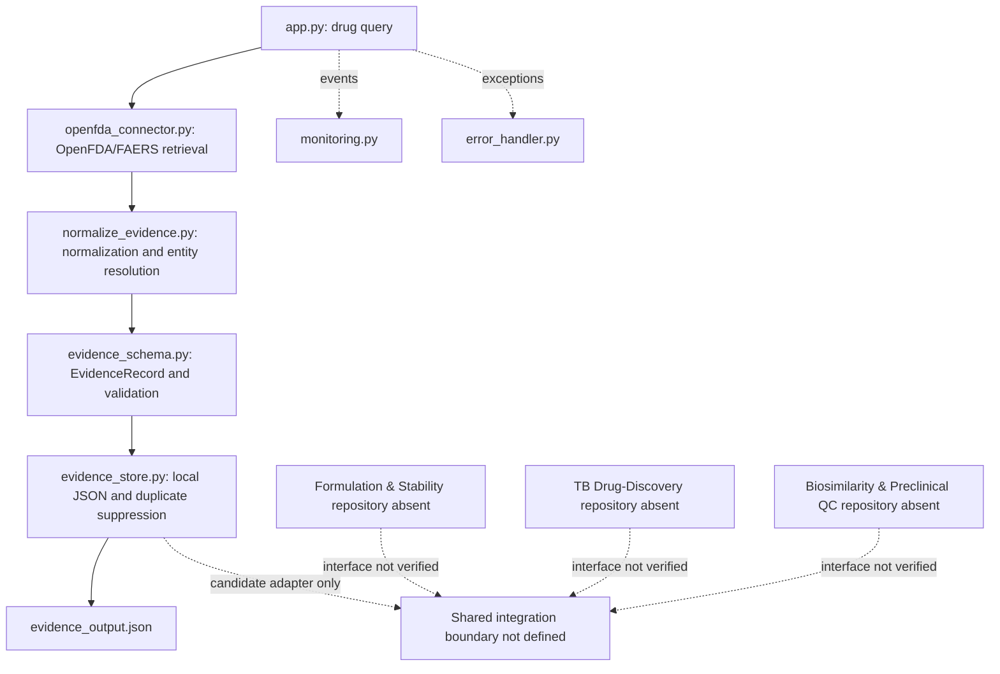

# Biotech Convergence Map

## Observed Repository Boundary

Only the pharmacovigilance evidence pipeline is present in this workspace. The map below separates demonstrated modules from proposed/absent streams; it does not claim that the conceptual four-stream architecture exists in code.

## Actual Local Execution Order

`app.py` -> OpenFDA connector -> normalizer/entity resolution -> evidence schema validation -> JSON evidence store. Monitoring and the application error handler observe/control the CLI path. Tests exercise connector behavior with mocks and normalization/schema/storage paths with synthetic fixtures.

## Integration Principle

Treat each capability's domain-specific processing as owned by that module. A shared layer may eventually standardize evidence envelopes, provenance, validation outcomes, and observability, but that boundary must be based on all four actual repositories and agreed contracts. Do not centralize scientific classification or transform evidence quality into scientific conclusions.

## Candidate Sequence

1. Acquire and audit missing repositories and submissions.
2. Compare schemas, source identity, provenance, data-origin labels, validation, and error behavior.
3. Define a minimal versioned envelope and adapters without merging domain logic.
4. Verify each adapter using deterministic fixtures, including invalid, duplicate, conflicting, empty, and malformed inputs.
5. Run system integration and independent audit; retain logs, outputs, and limitations.
